### Learning objectives {.unnumbered}

Quarto is a modern open-source publishing system that turns plain text and code into publication-ready papers, slides, websites, books, and teaching materials. It unifies writing and computation, supports seamless reproducible workflows, and bridges the gap between conducting, writing, and communicating research.

This step-by-step introduction to Quarto for academic research and publication covers:

-   the concept of literate programming
-   why reproducibility matters
-   how to use Quarto in RStudio
-   how to write research reports, theses, and academic papers in Quarto
-   how to insert tables, images, plots, and bibliographic references in Quarto documents
-   how to export and share Quarto documents in different formats including HTML, PDF, LibreOffice Writer, and Microsoft Word.

 [Allison Horst](https://allisonhorst.com/cetinkaya-rundel-lowndes-quarto-keynote) from the ["Hello, Quarto" keynote](https://mine.quarto.pub/hello-quarto/#/hello-quarto-title) by Julia Lowndes and Mine Çetinkaya-Rundel, first presented at the RStudio Conference 2022)](images/AHorst_Quarto.png){#fig-QuartoFormats fig-alt="A schematic representing the multi-language input (e.g. Python, R, Observable, Julia) and multi-format output (e.g. PDF, html, Word documents, and more) versatility of Quarto."}

### How to use {.unnumbered}

This introduction to Quarto may be used for self-study or as teaching material as part of a course or workshop.

A [PDF](https://elenlefoll.quarto.pub/quarto4research/Quarto4Research.pdf) and an [online HTML version](https://elenlefoll.quarto.pub/quarto4research/) are available. You are encouraged to try things out and to answer the quiz questions (available in the online version only) to test your understanding as you go along. Once you've worked your way through this guide, you'll be ready to start writing your own term paper, dissertation, thesis, research report, or journal article in Quarto!

Educators are encouraged to adapt this Open Educational Resource (OER) to their students' needs and interests. The guide was itself written in Quarto and the source code is available for editing and reuse on [Zenodo](https://doi.org/10.5281/zenodo.18913131). The OER is shared under a [CC BY 4.0](https://creativecommons.org/licenses/by/4.0/) license. Any reuse or adaptation should include the following reference:

> Le Foll, Elen. 2026. Quarto for reproducible research workflows and academic publishing. Open Educational Resource. <https://doi.org/10.5281/zenodo.18913131>. <https://elenlefoll.quarto.pub/quarto4research/> (last accessed DATE).

The present OER is an adaptation of "Rep`R`oducible research and academic w`R`iting in Quarto" from @lefollDataAnalysisLanguage2025[: Chapter 14].

```{r}
#| include: false
library(checkdown)
```

::: callout-important
### Downloading the tutorial data

This tutorial is based on real research data analysed in:

> Dąbrowska, Ewa. 2019. Experience, Aptitude, and Individual Differences in Linguistic Attainment: A Comparison of Native and Nonnative Speakers. Language Learning 69(S1). 72-100. <https://doi.org/10.1111/lang.12323>.

We will work with the original datasets which correspond to data collected in England from English native speakers (L1 data) and speakers of English as a second language (L2 data). The author, Ewa Dąbrowska, generously shared her data on a public repository for applied linguistics research, [IRIS](www.iris-database.org).

Whilst you could download the two CSV files directly from the IRIS database, for the purposes of this tutorial, I recommend downloading a compressed (ZIP) file containing both datasets and the folder structure that we will use throughout this tutorial instead:

-   Download `LearningQuarto.zip` from: <https://doi.org/10.5281/zenodo.18913131>.

Once you have downloaded the ZIP file, make sure that you decompress it [see @lefollDataAnalysisLanguage2025: [Section 2.3](https://elenlefoll.github.io/RstatsTextbook/2_Data.html#sec-FileExtensions)] before proceeding. Do not open the CSV files in Microsoft Excel as this could potentially permanently damage the files [see e.g. @lefollDataAnalysisLanguage2025: [Section 2.6](https://elenlefoll.github.io/RstatsTextbook/2_Data.html#sec-ExcelWarning) for further information]!
:::

# Literate programming {#sec-LitProgramming}

At its core, literate programming is about combining text, code, and code outputs (i.e. tables, statistics, and plots) within a single document that can be exported into different formats for sharing and publishing. If you've ever found yourself copying-and-pasting statistics, tables, or plots from different software into a text document containing your manuscript, you will know how error-prone that process is and how frustrating it is to have to repeat the operation every time something gets updated further up the research pipeline. Applying literate programming to academic writing avoids such situations altogether. It helps us to conduct and communicate our research in a more reliable and efficient manner.

Literate programming can be implemented in different authoring formats. Up until very recently, the most common format for R projects was [R Markdown](https://rmarkdown.rstudio.com/). For Python projects, [Jupyter Notebooks](https://jupyter.org/) remains the standard to date. This guide, however, focuses on Quarto, a relatively new [open-source](https://en.wikipedia.org/wiki/Free_and_open-source "Free and open-source") scientific and technical authoring and publishing system that has the advantage of supporting many different programming languages. This means that code in R, Python, Julia, and many other languages can be combined into one document, making project management and collaboration much easier. Quarto also allows us to readily export (or 'render') our documents to multiple formats such as HTML, PDF, and Word (see @fig-QuartoFormats and @sec-PublishingFormats).

Literate programming was popularised for data science, but is particularly well suited to academic research and teaching. Fun fact: This guide was written in Quarto! I chose this format because it allows for the seamless combination of explanations with nicely formatted code and code outputs. It also automatically generates consistent section and figure numbers, cross-references, bibliographic references, and much more. The `.qmd` source document is available on [Zenodo](https://doi.org/10.5281/zenodo.18913131) and you are encouraged to explore it to learn more about the many possibilities that Quarto offers students, researchers, and data scientists.

::: callout-note
### Summary {.unnumbered}

Quarto documents are designed to:

1.  Help you **collaborate** with other researchers (including your future self!) who are interested in both reproducing your results and understanding how you reached them (i.e. the code).

2.  Provide you with a **convenient environment** in which to do research - a kind of "modern-day lab notebook where you can capture not only what you did, but also what you were thinking" [@wickhamDataScienceImport2023].

3.  Help you **communicate** your research with others, including those who are not familiar with any programming languages.
:::

## Getting started with Quarto {#sec-StartQuarto}

We will be writing Quarto documents from the *RStudio* IDE[^1], which conveniently ships with a version of Quarto, meaning that no additional installation[^2] is required for you to use Quarto in *RStudio*. To get started with Quarto in *RStudio*:

[^1]: Many other IDEs (Integrated Developer Environments) support Quarto, including [JupyterLab](https://jupyter.org/), [Neovim](https://neovim.io/), [Positron](https://positron.posit.co/), and [VS Code](https://code.visualstudio.com/download). Feel free to pick the IDE that you are most comfortable with! The official [Quarto guide](https://quarto.org/docs/manuscripts/authoring/jupyterlab.html) offers a great starting point to author manuscript in Jupyter and VS Code, as well as RStudio.

[^2]: If you need to install Quarto, go to <https://quarto.org/docs/get-started/> and download the latest Quarto version that is compatible with your operating system. Once the download is completed (which may take several minutes), double-click on the installer file that you downloaded and click your way through the installation process.

\pagebreak

1.  Install both [R](https://cran.r-project.org/) and [*RStudio*](https://posit.co/download/rstudio-desktop/) on your computer. Detailed installation and recommended set-up instructions can be found in @lefollDataAnalysisLanguage2025: [Section 4.2](https://elenlefoll.github.io/RstatsTextbook/4_InstallingR.html#installing-r-and-rstudio).

2.  Open *RStudio* and create a new Project by selecting *File \> New Project...* in the main menu, or by clicking the "Create a project" button in the upper toolbar.

3.  A dialogue menu will appear. You should already have downloaded and decompressed `LearningQuarto.zip` (see above), which means that we can select the second option "Existing Directory" (see @fig-CreateProject).

    ::: {layout="[[47.5,-5,47.5], [100]]"}
    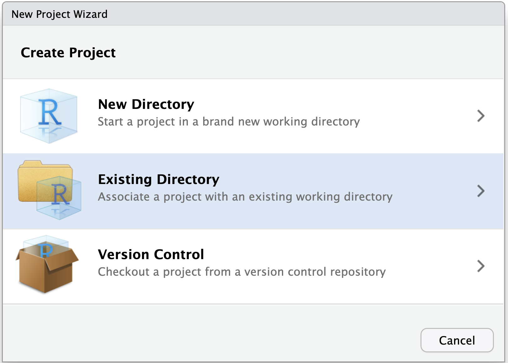{#fig-CreateProject}

    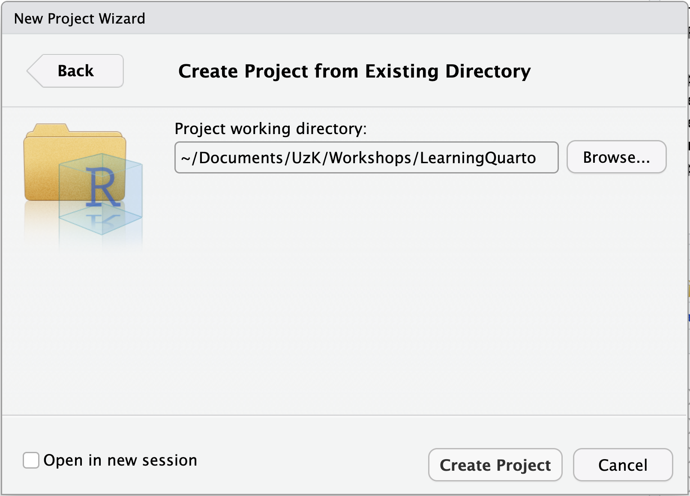{#fig-CreateProject2}
    :::

4.  Click "Browse" to navigate to the location of the project directory "Learning Quarto" on your own computer and then click "Create Project" (@fig-CreateProject2).

5.  Then, create a new Quarto document by navigating to *File \> New File \> Quarto Document...*, or clicking on the "new document" button and selecting "*Quarto Document..."*. A dialogue menu will appear (@fig-QuartoNew). Leave everything as is and simply click on "Create" at the bottom.

    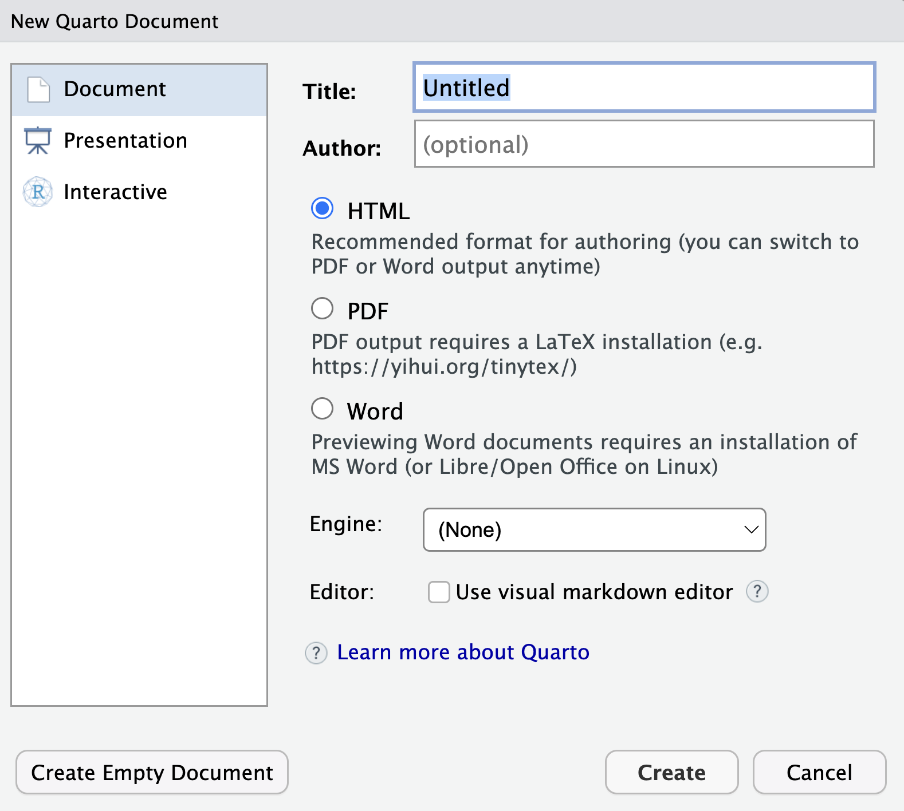{#fig-QuartoNew width="60%"}

6.  *RStudio* has now opened a new, untitled Quarto file (`.qmd`). Depending on your settings, your new Quarto document may include some template material, which you can delete. Change the title of your Quarto document (which is not the same as its filename!) and add three further lines to the **document header** by copying and pasting the following lines at the top of the document, replacing the default header. Quarto document headers[^3] are written in **YAML** which, I kid you not, stands for *Yet Another Markup Language*!

[^3]: Note that, in YAML syntax, character strings that include special characters (e.g. `'`) need to be enclosed in quotation marks.

```{yaml}
---
title: Learning Quarto
subtitle: "by reproducing the descriptive statistics of Dąbrowska's (2019) study"
author: Write your name here
date: last-modified
---
```

6.  Click on the "save" button in the menu bar or navigate to File \> Save to save your .qmd file. You will be prompted to give it a name. This could be `LearningQuarto.qmd` (see @navarroProjectStructure2022 for excellent tips on how to name and organise files).

7.  To check your Quarto installation, render your document by either selecting *File \> Render Document* in the main menu, or clicking on "Render" button in the Quarto menu bar (see @fig-QuartoRender). Your `.qmd` file will automatically be rendered to HTML (Quarto's default rendering format).

    {#fig-QuartoRender width="80%"}

8.  Navigate to the folder where you saved your `.qmd` file to find the rendered HTML file. You can use a Finder (on macOS) or File Explorer window (on Windows) or go to the "Files" pane in *RStudio* to do this. The rendered version of your file will have the same filename as your Quarto document, but with the file extension `.html` (e.g. `LearningQuarto.html`). If you open on the file, it will appear in your default web browser (e.g. Firefox, Chrome, Safari). You should see that the HTML document features the title of your document, your name as the author, and today's date (see @fig-QuartoHTML). For now, the document is empty. In the next sections, you will learn how to add text, code, and code outputs to your Quarto document.

{#fig-QuartoHTML width="80%"}

## Visual editor

You may have noticed that *RStudio* proposes two different modes in which Quarto documents can be edited: **Source** and **Visual** (see @fig-QuartoModes).

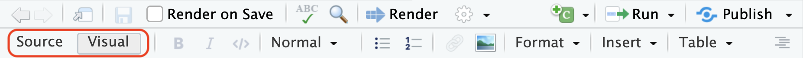{#fig-QuartoModes width="100%"}

The Visual mode offers a [WYSIWYM](https://en.wikipedia.org/wiki/WYSIWYM) (What You See Is What You Mean) authoring experience. This means that, in Visual model, you will immediately see the effect of your formatting on screen. For example, to format a word in italics, you can click on the corresponding button in the toolbar (see @fig-QuartoModes) or use the keyboard shortcut (Cmd/Ctrl + I) — just like you would in text-processing software — and this will immediately display the text in italics.

::: callout-note
To make writing in Quarto more convenient and less error-prone, you can switch on a **spell-checker** within *RStudio*. To do so, go to *Tools \> Global Options... \> Spelling*. You may need to restart *RStudio* for the change to take effect.
:::

:::: {.content-visible when-format="html"}
::: {.callout-tip collapse="false"}
#### Your turn! {.unnumbered}

[**Q1**]{style="color:green;"} In this task, you will practice using *RStudio*'s Visual model to format text in a Quarto document.

-   In a new line beginning after the final `---` of the YAML header, paste the introduction text below.
-   Using the Quarto editing toolbar, format the text so that, in the Visual mode, it looks like the text displayed in @fig-QuartoIntro.
-   Render the document and compare how it is formatted in the HTML version.

```{markdown}
Introduction

The aim of this report is to reproduce the descriptive statistics reported in Dąbrowska (2019: 5-6) using the original datasets (Dąbrowska 2019: Appendix S4):

Method

Participants

Ninety native speakers (42 male and 48 female) and 67 nonnative speakers of English (21 male and 46 female) were recruited through personal contacts, church and social clubs, and advertisements in local newspapers. Participants were told that the purpose of the study was to examine individual differences in native and nonnative speakers’ knowledge of English and whether these differences are related to their linguistic experience and abilities. All participants signed a written consent form before the research commenced.

The L1 participants were all born and raised in the United Kingdom and were selected to ensure a range of ages, occupations, and educational backgrounds. The age range was from 17 to 65 years (M = 38, SD = 16). Twenty-two percent of the participants held manual jobs, 24% held clerical positions, and 28% had professional-level jobs or were studying for a degree; the remaining 26% were occupationally inactive (i.e. unemployed, retired, or homemakers). In terms of education, participants’ backgrounds ranged from no formal qualifications to Ph.D., with corresponding differences in the number of years spent in full-time education (from 10 to 21; M = 14, SD = 2). Six participants reported a working knowledge of another language; the rest described themselves as monolinguals.
```

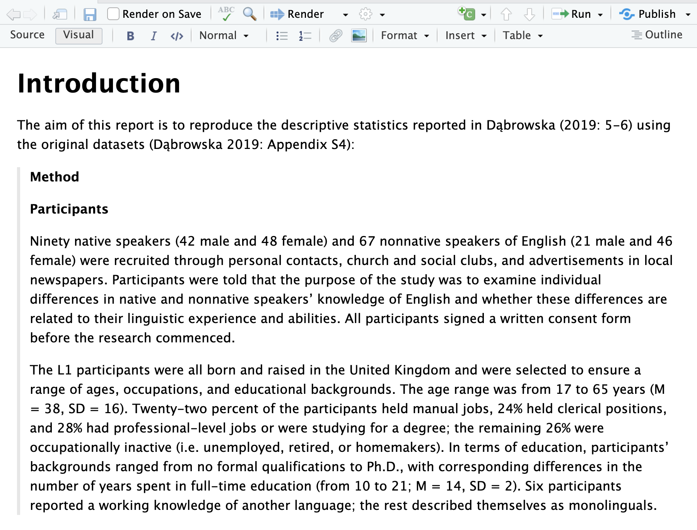{#fig-QuartoIntro}

In *RStudio*'s visual mode, what is the name of the formatting option that indents and adds a grey line to the left of a quoted paragraph as in @fig-QuartoIntro?

```{r}
#| echo: false
#| label: "Q1"

check_question("Blockquote",
                 options = c("Blockquote",
                 "Line Block",
                 "Code Block", 
                 "Div",
                 "Span"), 
               random_answer_order = TRUE,
               q_id = "Q1", 
               type = "radio",
               button_label = "Check answer",
               right = "That's right! The other options can also be found in the \"Format\" drop-down menu, but blockquote is correct.",
               wrong = "No, that's not it. Try these options out and these what effect they have.")
check_hint("All of these options can be found in RStudio's in the \"Format\" drop-down menu in the Visual mode.", hint_title = "🐭 Click on the mouse for a hint.")
```
:::
::::

:::: {.content-visible when-format="html"}
::: {.callout-note collapse="true"}
#### Click here for the full solution to [**Q1**]{style="color:green;"}

In the Visual mode (see @fig-QuartoVisual a), click on the "Normal" drop-down menu (see @fig-QuartoVisual b) to change the formatting of the word *Introduction* to the "Header 1" style. To format the long citation, choose the "Blockquote" option from the the "Format" drop-down menu (see @fig-QuartoVisual c).

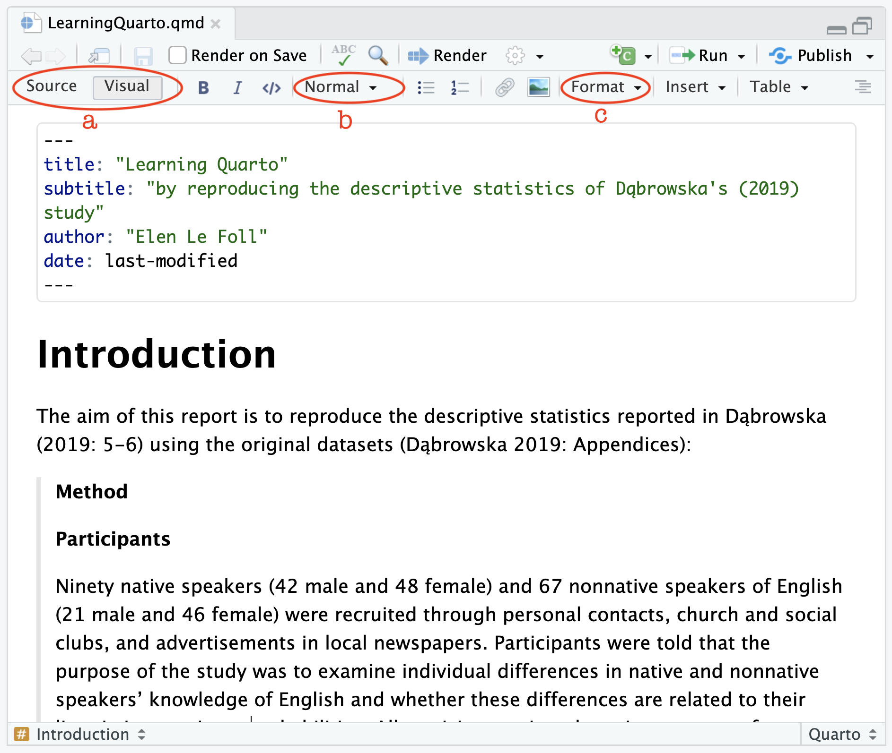{#fig-QuartoVisual width="442"}
:::
::::

## Markdown text {#sec-Markdown}

Writing and formatting text in *RStudio*'s Visual editor is very similar to writing in a word-processing software such as LibreOffice Writer or Microsoft Word. In the background, however, *RStudio* automatically converts your formatted text to Markdown in the underlying source code of your `.qmd` file. Markdown is a **plain-text format**. For example, in Markdown, words in italics are enclosed in asterisks like this: `*italics*`. @tbl-markdown displays the Markdown syntax for other formatting options commonly used in academic writing.

The best way to get the hang of Markdown is simply to try things out. You will also find a handy cheatsheet under *Help \> Markdown Quick Reference*. Remember that you can always go back to the **Visual** mode to format your text if that's easier for you. When it comes to debugging any Quarto syntax errors, however, it's usually easier to catch these in plain text, so you'll typically want to switch to the **Source** mode for that.

:::: {.content-visible when-format="html"}
::: {.callout-tip collapse="false"}
#### Your turn! {.unnumbered}

Switch to the **Source mode** to view the text that you formatted in the Visual editor for [**Task 1**]{style="color:green;"} in Markdown format.

[**Q2**]{style="color:green;"} How is text highlighted in bold displayed in Markdown?

```{r}
#| echo: false
#| label: "Q2"

check_question("**bold text**",
               options = c("**bold text**", 
                           "*bold text*", 
                           "# bold text", 
                           "[bold text]{.bold}",
                           "BOLD TEXT"), 
               type = "radio",
               q_id = "Q2", 
button_label = "Check answer",
random_answer_order = TRUE,
right = "That's right! 🎉",
wrong = "Hummm, are you sure? Go back to the Visual editor and format a word in bold there then switch back to the Source mode to see what happens.")
```

[**Q3**]{style="color:green;"} How is a first-level heading displayed in Markdown?

```{r}
#| echo: false
#| label: "Q3"

check_question("# Heading 1",
               options = c("**Heading 1**", 
                           "[*Heading 1*]", 
                           "# Heading 1", 
                           "<h1>Heading 1</h1>",
                           "HEADING 1"), 
               type = "radio",
               q_id = "Q3", 
button_label = "Check answer",
random_answer_order = TRUE,
right = "That's right! 🎉",
wrong = "Hummm, are you sure? How is the word \"Introduction\" formatted in your text?")
```

[**Q4**]{style="color:green;"} How are block quotes formatted in Markdown?

```{r}
#| echo: false
#| label: "Q4"

check_question("Every line begins with > followed by a space",
               options = c("Every line begins with >", 
                           "Every line begins with > followed by a tab", 
                           "Every line begins with > followed by a space", 
                           "The text is coloured green"), 
               type = "radio",
               q_id = "Q4", 
button_label = "Check answer",
random_answer_order = TRUE,
right = "That's right! 🎉",
wrong = "Hummm, are you sure? Go back to the Source code of your Quarto document and check out the formatting of a block quote.")
```

[**Q5**]{style="color:green;"} How will the word `~~mystery~~` be formatted in Markdown?

```{r}
#| echo: false
#| label: "Q5"

check_question("crossed-out",
               options = c("in italics", 
                           "as a subsection heading", 
                           "as computer code", 
                           "crossed-out",
                           "in grey"), 
               type = "radio",
               q_id = "Q5", 
button_label = "Check answer",
random_answer_order = TRUE,
right = "That's right! 🎉",
wrong = "Hummm, are you sure? Have you tried inserting `~~mystery~~` in the Source code of your Quarto document and then switching to the Visual editor to see what happens?")
```

:::
::::

Markdown is gaining in popularity and is now widely supported across many platforms, from text editors to content management systems, ensuring that your formatting remains consistent and portable. It's increasingly used to write documentation, blog posts, or simply to take notes. Check out the [Markdown Guide](https://www.markdownguide.org/basic-syntax/) to learn more.

+--------------------------------------+---------------------------------------+
| Markdown syntax                      | Rendered output                       |
+======================================+=======================================+
| `*italics*`                          | *italics*                             |
+--------------------------------------+---------------------------------------+
| `**bold**`                           | **bold**                              |
+--------------------------------------+---------------------------------------+
| `***bold italics***`                 | bold italics                          |
+--------------------------------------+---------------------------------------+
| `superscript^2^ / subscript~2~`      | superscript^2^ / subscript~2~         |
+--------------------------------------+---------------------------------------+
| `~~strikethrough~~`                  | ~~strikethrough~~                     |
+--------------------------------------+---------------------------------------+
| `` `verbatim code` ``                | `verbatim code`                       |
+--------------------------------------+---------------------------------------+
| `# Heading 1`                        | # Heading 1 {.unnumbered .unlisted}   |
+--------------------------------------+---------------------------------------+
| `## Heading 2`                       | ## Heading 2 {.unnumbered .unlisted}  |
+--------------------------------------+---------------------------------------+
| `### Heading 3`                      | ### Heading 3 {.unnumbered .unlisted} |
+--------------------------------------+---------------------------------------+
| `<https://quarto.org>`               | <https://quarto.org>                  |
+--------------------------------------+---------------------------------------+
| `[Quarto guide](https://quarto.org)` | [Quarto guide](https://quarto.org)    |
+--------------------------------------+---------------------------------------+
| ``` markdown                         | -   bullet-point list                 |
| * bullet-point list                  |                                       |
|   + sub-item 1                       |     -   sub-item 1                    |
|   + sub-item 2                       |     -   sub-item 2                    |
|     - sub-sub-item 1                 |         -   sub-sub-item 1            |
| ```                                  |                                       |
+--------------------------------------+---------------------------------------+
| ``` markdown                         | 1.  numbered list                     |
| 1. numbered list                     | 2.  item 2                            |
| 2. item 2                            |     i.  sub-item 1                    |
|    i. sub-item 1                     |         A.  sub-sub-item 1            |
|       A.  sub-sub-item 1             |                                       |
| ```                                  |                                       |
+--------------------------------------+---------------------------------------+

: Commonly used formatting options and their markdown syntax (adapted from the official [Quarto Guide](https://quarto.org/docs/authoring/markdown-basics.html)) {#tbl-markdown tbl-colwidths="\[50,50\]"}

## Code chunks {#sec-Chunks}

To run code inside a Quarto document, we need to insert a code chunk. There are three ways to do so:

1.  Using the keyboard shortcut Cmd/Ctrl + Option/Alt + i
2.  Clicking on the green "Insert chunk" button icon in the editor toolbar
3.  Manually typing the chunk delimiter ```` ```{r} ```` ```` to begin the code chunk and ``` ```` to close it.

In the code chunk below, `{r}` tells Quarto that this chunk is written in the programming language `R`. If we wanted to embed a chunk of Python code, we'd have to begin it with ```` ```{python} ```` instead.

```{{r}}
plot(1:10)
```

Using one of the three aforementioned options, insert the above R code chunk in your document. It is definitely worth learning the keyboard shortcut as it will save you a lot of time in the long run!

To run code within a Quarto document, we can either run:

-   each individual line of code using the keyboard shortcut Cmd/Ctrl + Enter or
-   the entire code chunk either by clicking the "Run"icon or with the shortcut Shift + Cmd/Ctrl + Enter.

Try running the R code chunk that you just inserted and see what happens.[^4] *RStudio* will execute the code and display the outcome of the code either within your document (below the chunk) or in the Console pane, depending on your *RStudio* settings.[^5]

[^4]: If you get the following error message `Error in plot.new() : figure margins too large`, this is because your Plots pane in RStudio is either hidden from view or too small for the plot to be printed there. Enlarge this window and then, re-type the command `plot(1:10)` in the Console pane and press enter again [see also @lefollDataAnalysisLanguage2025: [Section 4.3.2](https://elenlefoll.github.io/RstatsTextbook/4_InstallingR.html#testing-rstudio)].

[^5]: You can change this behaviour in your *RStudio* preferences under *Tools \> Global Options \>* R Markdown by selecting or unselecting the option: "Show output inline for all R Markdown documents".

Chunk output can be customised with **chunk options**. There are many options to choose from, but the most important options control whether a code block should be executed when the Quarto document is rendered and what results are inserted in the rendered version:

-   `eval: false` prevents code from being evaluated. Given that the code is not run, no code outputs are generated either.

-   `include: false` runs the code, but does not show the code or its outputs in the rendered document. This option is useful for code chunks that are not informative to the readers of your document.

-   `echo: false` prevents the code from appearing in the rendered document, but displays the code outputs. This option is useful when you want to present the results of your analyses to people who are not interested in the underlying code.

-   `echo: fenced` prints the code chunks in the rendered document together with the fenced code chunk delimiter (e.g. ```` ```{r} ````). This option is useful when creating pedagogical materials on how to write code chunks in Quarto (see e.g. [source code](https://doi.org/10.5281/zenodo.18913131) of this tutorial).

-   `message: false` or `warning: false` prevents messages or warnings from appearing in the rendered document.

It is also possible to label code chunks using the `label` option (see code chunk below). This can help to navigate long Quarto documents using the drop-down menu available in the bottom-left corner of the Source pane (see @fig-QuartoEchoFalse). It also helps to quickly identify which code chunk is causing errors during rendering. Chunk labels should be short but meaningful.

```{{r}}
#| echo: false
#| label: "Example plot"
plot(1:10)
```

The chunk above has two chunk options. The first means that only the chunk output, the plot, will be displayed in the rendered version of the Quarto document, not the code. The second is the chunk label.

In *RStudio* the easiest way to set a chunk option is by clicking the gear icon in the top right corner of the chunk that you want to modify. This way, you can both choose a label and set chunk options. If you prefer to write code chunk options manually, these are placed at the top of the corresponding chunk following `#|`, as in the chunk above and @fig-QuartoEchoFalse. As you can see in @fig-EchoFalseRendered, the `echo: false` chunk option means that the rendered document includes the chunk output, but not the code itself.

::: {layout="[[47.5,-5,47.5], [100]]"}
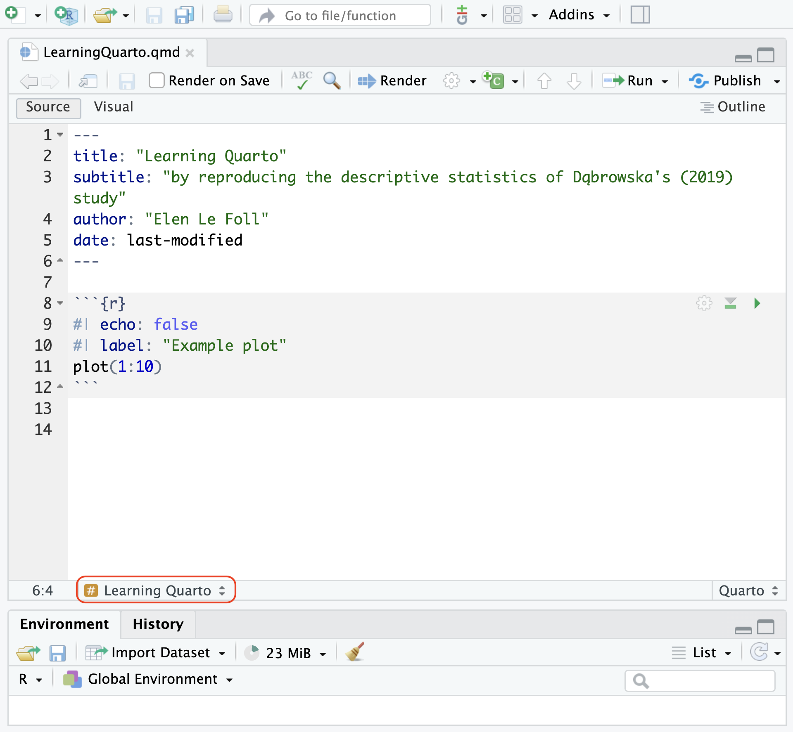{#fig-QuartoEchoFalse fig-alt="Quarto document open in Source mode in RStudio with the header that we inserted earlier (Title: Learning Quarto, etc.) and the `plot(1:10)` R code chunk with a label and the code chunk option: echo: FALSE"}

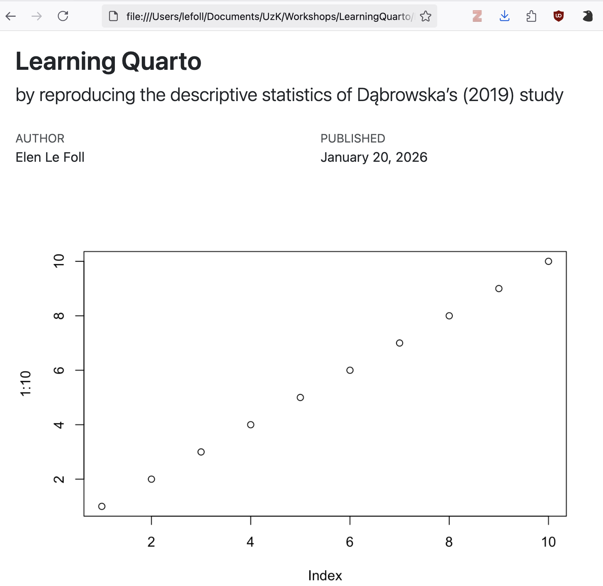{#fig-EchoFalseRendered fig-alt="The rendered version of the Quarto document shown in the previous figure. It includes the elements of the header and a simple line graph, but not the code to produce the graph."}
:::

:::: {.content-visible when-format="html"}
::: {.callout-tip collapse="false"}
#### Your turn! {.unnumbered}

In your Quarto document, add a label to your first R chunk and render your document to HTML.

```{r}
#| echo: fenced
#| label: "Set up"

library(here)
library(tidyverse)
```

[**Q6**]{style="color:green;"} What is the output of the `setup` chunk in your rendered `.html` document?

```{r}
#| echo: false
#| label: "Q6"

check_question("Two messages, one per loaded library.",
               options = c("Nothing.", 
                           "Two messages, one per loaded library.", 
                           "A conflict error message.", 
                           "An error message beginning with: \"Error in `library()`: ! there is no package called...",
                           "An error message ending in: \"Execution halted\"."), 
               type = "check",
               q_id = "Q6", 
button_label = "Check answer",
right = "That's right! What you are seeing are messages that the {here} and the {tidyverse} libraries automatically output when they are correctly loaded. To find out more about conflicts, see Section 9.2.",
wrong = "Oh no, something's gone wrong... If you are getting the fourth error message, this means that your document could not be rendered because one of the two packages has not been installed yet. Install them and then try rendering your document again. Also, check that you have not misspelt the names of the packages! If you are getting the last error message, there is a problem with your Quarto document, which means that it cannot be rendered. Read the rest of the error message to understand where the problem lies. It is very likely to be a small syntax error or typo.") 
check_hint("Remember that a conflict message is *not* an error message, it merely informs us about potential conflicts when two different packages have functions with the same name (see Section 9.2).", 
           hint_title = "<br>🐭 Click on the mouse for a hint.")
```

[**Q7**]{style="color:green;"} Which code chunk option can you use to remove the two messages from the rendered version of your Quarto document, whilst still ensuring that the `setup` chunk is displayed and executed so that the libraries can be used in future code chunks?

```{r}
#| echo: false
#| label: "Q7"

check_question("#| message: false",
               options = c("#| message: false", 
                           "#| message: true", 
                           "#| messages: false", 
                           "#| eval: true",
                           "#| echo: false"), 
               type = "radio",
               q_id = "Q7", 
button_label = "Check answer",
random_answer_order = TRUE,
right = "That's right, well done!",
wrong = "No, not quite. Have you tried inserting this code chunk option in your Quarto document and then rendering it to see what happens?")
check_hint("Code chunk options are applied to the entire chunk, so in this case, the option will apply to the outputs of both loaded libraries.", 
           hint_title = "<br>🐭 Click on the mouse for a hint.")

```

[**Q8**]{style="color:green;"} Which code chunk option can you use to remove both the `setup` chunk and its outputs from the rendered version of your Quarto document, whilst still ensuring that the libraries are loaded so that their functions can be used further down in the document?

```{r}
#| echo: false
#| label: "Q8"

check_question("#| include: false",
               options = c("#| include: false", 
                           "#| display: false", 
                           "#| echo: false", 
                           "#| eval: false",
                           "#| echo: true"), 
               type = "radio",
               q_id = "Q8", 
button_label = "Check answer",
random_answer_order = TRUE,
right = "That's right, well done!",
wrong = "No, not quite. Have you tried inserting this code chunk option in your Quarto document and then rendering it to see what happens?")
check_hint("You may be tempted to choose `echo: false`, which will remove the code from the rendered document. However, this will also keep its outputs, which includes the messages that we do not want displayed in our rendered document.", 
           hint_title = "<br>🐭 Click on the mouse for a hint.")
```

:::
::::

\pagebreak

## Inline code {#sec-Inline}

So far, we have seen how we can insert and format text in Quarto and how we can add code chunks with various options. But, to make the most of literate programming, we want to combine the two.

Copy the following two R chunks into your Quarto document to:

a.  check that the packages required for this project are installed and then load them and
b.  load the Dąbrowska (2019) data so that they may be used in your Quarto document.

The first chunk has been set to `include: false`, which means that the packages will be loaded, but nothing will appear in the rendered version of the document.

```{r}
#| label: packages
#| include: false

# List of the packages necessary for this Quarto document:
packages <- c("here", "tidyverse", "xfun")

# Function to install the packages that are not yet installed:
installed_packages <- packages %in% 
  rownames(installed.packages()) 

if (any(installed_packages == FALSE)) { install.packages(packages[!installed_packages], repos = "https://packagemanager.rstudio.com/all/latest") }

# Function to load all the packages at once:
lapply(packages, library, character.only = TRUE)
```

```{{r}}
#| label: "Package installation and loading"
#| include: false

# List of the packages necessary for this Quarto document:
packages <- c("here", "tidyverse", "xfun")

# Function to install the packages that are not yet installed:
installed_packages <- packages %in% 
  rownames(installed.packages()) 

if (any(installed_packages == FALSE)) { install.packages(packages[!installed_packages], repos = "https://packagemanager.rstudio.com/all/latest") }

# Function to load all the packages at once:
lapply(packages, library, character.only = TRUE)
```

As the `import-data` chunk requires the `here()` function, it must come *after* the `setup` chunk because, when the document is rendered, code chunks are executed in the order that they appear. If the {here} library is not loaded *before* the data are imported, the rendering process will be aborted and an error message will be displayed in the Console. In the chunk below, the `here()` function tells R that it can find the two CSV files in a subfolder of the main project directory (i.e. folder) called "data". If you are running into errors when trying to load the data, make sure that this is where the files are stored on your own computer or adjust the relative paths, as necessary.

```{{r}}
#| label: import-data
#| include: false

L1.data <- read.csv(file = here("data", "L1_data.csv"))
L2.data <- read.csv(file = here("data", "L2_data.csv"))
```

```{r}
#| label: import-data-for-real
#| include: false

L1.data <- read.csv(file = here("data", "L1_data.csv"))
L2.data <- read.csv(file = here("data", "L2_data.csv"))
```

To begin, we will reproduce the following basic descriptive statistics about the two datasets:

> "Ninety native speakers (42 male and 48 female) and 67 nonnative speakers of English (21 male and 46 female) were recruited through personal contacts, church and social clubs, and advertisements in local newspapers" [@DabrowskaExperienceAptitudeIndividual2019: 5].

These are "tidy" datasets [@horstOpenscapesTidyData2020], which means that the number of native and non-native participants corresponds to the number of rows in the corresponding dataset:

```{r}
nrow(L1.data)
nrow(L2.data)
```

In Quarto, we can use **inline code** to dynamically insert these numbers into our paragraph. Inline code in R begins with `` `{r} `` and ends with a single backtick `` ` ``.[^6] It is best to use the Source mode to insert inline code. Using the Source mode, add the following section to your Quarto document and render it to HTML.

[^6]: If you look at the source code of this tutorial, you may notice that it sometimes makes use of double curly brackets `{{r}}` to introduce inline code. This syntax is only necessary in a tutorials: it means that the rendered version of the document will include the code fencing `{r}` in the output (similar to the `echo: fenced` option for code chunks, see @sec-Chunks).

``` markdown
## Descriptive statistics about the participants

 `{{r}} nrow(L1.data)` native speakers and `{{r}} nrow(L2.data)` nonnative speakers of English were recruited through personal contacts, church and social clubs, and advertisements in local newspapers.
```

The rendered version should read like this (if you are obtaining different numbers, this either means that you have tempered with the original data files or that they have been corrupted)[^7]:

[^7]: Using Microsoft Excel to open these `.csv` files can corrupt the files. This can happen even if you did not open Excel yourself (e.g. on some Windows computers, this is sometimes done automatically as part of the download process). To find out more, see Le Foll [-@lefollDataAnalysisLanguage2025: [Section 2.6](https://elenlefoll.github.io/RstatsTextbook/2_Data.html#sec-ExcelWarning)]

> ### Descriptive statistics about the participants {.unnumbered .unlisted}
>
> 90 native speakers and 67 nonnative speakers of English were recruited through personal contacts, church and social clubs, and advertisements in local newspapers.

Inline code should only be used for very simple code, ideally with no more than one function, as in `` `{{r}} nrow(L1.data)` ``. To insert the output of more complex operations, it is best to write the code and temporarily save its output(s) in a hidden code chunk (using the option `#| include: false`, see @sec-Chunks).

```{r}
#| label: L1-gender
#| include: false
#| echo: fenced

L1.males <- L1.data |>
  filter(Gender == "M") |>
  count()

L1.females <- L1.data |>
  filter(Gender == "F") |>
  count()
```

The saved objects (`L1.males` and `L1.females`) each contain one number. They can therefore be directly called within the text as inline code:

``` markdown
 `{{r}} nrow(L1.data)` native speakers (`{{r}} L1.males` male and `{{r}} L1.females` female) and `{{r}} nrow(L2.data)` nonnative speakers of English were recruited through personal contacts, church and social clubs, and advertisements in local newspapers.
```

When rendered, the paragraph will read:

> `{r} nrow(L1.data)` native speakers (`{r} L1.males` male and `{r} L1.females` female) and `{r} nrow(L2.data)` nonnative speakers of English were recruited through personal contacts, church and social clubs, and advertisements in local newspapers.

:::: {.content-visible when-format="html"}
::: {.callout-tip collapse="false"}
#### Your turn! {.unnumbered}

[**Q9**]{style="color:green;"} In your Quarto document, add a code chunk called `L2-gender` in which you compute the values necessary to complete the missing descriptive statistics in the sentence above. When rendered, your sentence should read:

> 90 native speakers (42 male and 48 female) and 67 nonnative speakers of English (21 male and 46 female) were recruited through personal contacts, church and social clubs, and advertisements in local newspapers.

Which value requires more than just one line of code?

```{r}
#| echo: false
#| label: "Q9"

check_question("The number of L2 female speakers",
                 options = c("The number of L2 female speakers",
                 "The number of L2 male speakers",
                 "The total number of L2 participants."), 
               random_answer_order = TRUE,
               q_id = "Q9", 
               type = "radio",
               button_label = "Check answer",
               right = "Well done for spotting the problem. Have you managed to solve it? If not, check the solution below.",
               wrong = "No, this value can be generated with a single R function. Check out the solution below to find out how to complete the task.")
```
:::
::::

:::: {.content-visible when-format="html"}
::: {.callout-note collapse="true"}
#### Click here for the solution to [**Q9**]{style="color:green;"}

To save the number of male L2 participants as an R object, we can follow the same procedure as above.

```{r}
L2.males <- L2.data |>  
  filter(Gender == "M") |>
  count()
```

For the number of female L2 participants, however, it's not so simple because some are labelled `f`, while others are labelled `F` [see e.g. @lefollDataAnalysisLanguage2025: [Section 9.4.2](https://elenlefoll.github.io/RstatsTextbook/9_DataWrangling.html#sec-across)]).

```{r}
table(L2.data$Gender)
```

Below are four possible methods to solve this issue (and there are many more still!):

```{r}
# Method 1:
L2.Females <- L2.data |> 
  filter(Gender == "F") |> 
  count()

L2.females <- L2.data |> 
  filter(Gender == "f") |> 
  count()

L2.allfemales <- L2.Females + L2.females 

# Method 2:
L2.allfemales <- L2.data |> 
  filter(Gender == "F" | Gender == "f") |> 
  count()

# Method 3:
L2.allfemales <- L2.data |> 
  filter(Gender %in% c("F", "f")) |> 
  count()

# Method 4:
L2.allfemales <- L2.data |> 
  mutate(Gender = toupper(Gender)) |> 
  filter(Gender == "F") |> 
  count()

```

Some of these methods are perhaps more elegant than others, but they are all acceptable. After all, they all work! 🙃

Once they are saved to the local environment, the values can be inserted inline in the usual way:

``` markdown

 `{{r}} nrow(L1.data)` native speakers (`{{r}} L1.males` male and `{{r}} L1.females` female) and `{{r}} nrow(L2.data)` nonnative speakers of English (`{{r}} L2.males` male and `{{r}} L2.allfemales` female) were recruited through personal contacts, church and social clubs, and advertisements in local newspapers. 
```
:::
::::

If we want to start our paragraph with "90" written in as a word rather than as digits, we can use the `numbers_to_words function()` function from the {xfun} package. First, let's test that the function works by running the following line of code:

```{r}
numbers_to_words(nrow(L1.data))
```

To start our paragraph with a capital letter, we'll need to set the function's `cap` argument to `TRUE`.

``` markdown
 `{{r}} numbers_to_words(nrow(L1.data), cap = TRUE)` native speakers (`{{r}} L1.males` male and `{{r}} L1.females` female) and `{{r}} nrow(L2.data)` nonnative speakers of English...
```

Next, we want to reproduce the following descriptive statistics about the L1 participants:

> "The L1 participants were all born and raised in the United Kingdom and were selected to ensure a range of ages, occupations, and educational backgrounds. The age range was from 17 to 65 years (*M* = 38, *SD* = 16)" [@DabrowskaExperienceAptitudeIndividual2019: 5].

We can use the base R functions `min()`, `max()`, `mean()`, and `sd()` to compute these values.

``` markdown
The L1 participants were all born and raised in the United Kingdom and were selected to ensure a range of ages, occupations, and educational backgrounds. The age range was from `{{r}} min(L1.data$Age)` to `{{r}} max(L1.data$Age)` years (*M* = `{{r}} mean(L1.data$Age)`, *SD* = `{{r}} sd(L1.data$Age)`).
```

The rendered document will read:

> The L1 participants were all born and raised in the United Kingdom and were selected to ensure a range of ages, occupations, and educational backgrounds. The age range was from `{r} min(L1.data$Age)` to `{r} max(L1.data$Age)` years (*M* = `{r} mean(L1.data$Age)`, *SD* = `{r} sd(L1.data$Age)`).

Whilst these values are correct, in practice, we want to round them off to the nearest integer. To this end, we can wrap the `round()` function around the `mean()` and `sd()` function [see @lefollDataAnalysisLanguage2025: [Section 7.5](https://elenlefoll.github.io/RstatsTextbook/7_VariablesFunctions.html#combining-functions-in-r)].

``` markdown
The L1 participants were all born and raised in the United Kingdom and were selected to ensure a range of ages, occupations, and educational backgrounds. The age range was from `{{r}} min(L1.data$Age)` to `{{r}} max(L1.data$Age)` years (*M* = `{{r}} round(mean(L1.data$Age))`, *SD* = `{{r}} round(sd(L1.data$Age))`).
```

The rendered document will read:

> The L1 participants were all born and raised in the United Kingdom and were selected to ensure a range of ages, occupations, and educational backgrounds. The age range was from `{r} min(L1.data$Age)` to `{r} max(L1.data$Age)` years (*M* = `{r} round(mean(L1.data$Age))`, *SD* = `{r} round(sd(L1.data$Age))`).

:::: {.content-visible when-format="html"}
::: {.callout-note collapse="true"}
### More complex inline computations

For more complex computations, it is much better to compute the values in a dedicated code chunk. This also allows you to add **code annotation** which is important to ensure that other researchers (and your future self!) understand the reasoning behind the code.

For example, the following annotated code chunk can be used to reproduce the descriptive statistics concerning L1 participants' professional occupations and foreign language skills.

```{r}
#| label: L1-jobs
#| echo: fenced

# Counting manual job participants using a tidyverse solution:
L1.manualjobs <- L1.data |> # Select L1 dataset
  count(OccupGroup) |> # Tally each level of OccupGroup
  mutate(proportion = n/sum(n)) |> # Calculate proportion
  filter(OccupGroup == "M") |> # Select only the manual occupations
  pull(proportion) |> # Select just the proportion value
  round(2)

# Alternative: Counting manual job participants using a base R solution:
L1.manualjobs <- round(proportions(table(L1.data$OccupGroup))["M"], digits = 2)

# Counting clerical job participants
L1.clerical <- round(proportions(table(L1.data$OccupGroup))["C"], digits = 2)

# Counting professional job participants
L1.pro.num <- L1.data |>
  filter(OccupGroup %in% c('PS', 'PS ')) |>
  count()

L1.pro <- round((L1.pro.num/ nrow(L1.data)), digits = 2)

# Counting professionally inactive participants
L1.inactive <- round(proportions(table(L1.data$OccupGroup))["I"], digits = 2)

# Counting participants who speak at least one language other than English
L1.otherlgs <- L1.data |>
  filter(OtherLgs != "None") |>
  count()

```

The values saved to the local environment as R objects can then be inserted inline within the Markdown text as follows:

``` markdown
 `{{r}} numbers_to_words((L1.manualjobs*100), cap = TRUE)` percent of the participants held manual jobs, `{{r}} L1.clerical*100`% held clerical positions, and `{{r}} L1.pro*100`% had professional-level jobs or were studying for a degree; the remaining `{{r}} L1.inactive*100`% were occupationally inactive (i.e. unemployed, retired, or homemakers). In terms of education, participants’ backgrounds ranged from no formal qualifications to Ph.D., with corresponding differences in the number of years spent in full-time education (from `{{r}} min(L1.data$EduYrs)` to `{{r}} max(L1.data$EduYrs)`; *M* = `{{r}} round(mean(L1.data$EduYrs))`, *SD* = `{{r}} round(sd(L1.data$EduYrs))`). `{{r}} L1.otherlgs` participants reported a working knowledge of another language; the rest described themselves as monolinguals.
```
:::
::::

:::: {.content-visible when-format="html"}
::: {.callout-tip collapse="false"}
#### Your turn! {.unnumbered}

Copy the code and text sections corresponding to the description of participants' professional occupations and education displayed @sec-Inline (in the textbox "More complex inline computations") into your Quarto document and render it to HTML. Compare the values in your rendered document with the original ones from the published study (see below).

> "Twenty-two percent of the participants held manual jobs, 24% held clerical positions, and 28% had professional-level jobs or were studying for a degree; the remaining 26% were occupationally inactive (i.e. unemployed, retired, or homemakers). In terms of education, participants' backgrounds ranged from no formal qualifications to Ph.D., with corresponding differences in the number of years spent in full-time education (from 10 to 21; M = 14, SD = 2). Six participants reported a working knowledge of another language; the rest described themselves as monolinguals" [@DabrowskaExperienceAptitudeIndividual2019: 6].

[**Q10**]{style="color:green;"} Compare the rendered version of your document with the original descriptive statistics reported in Dąbrowska [-@DabrowskaExperienceAptitudeIndividual2019: 6]. Could you successfully reproduce these descriptive statistics? Which values are different?

```{r}
#| echo: false
#| label: "Q10"

check_question("None of them.",
                 options = c("None of them.",
                 "The values expressed in percentages.",
                 "The standard deviations.",
                 "The number of non-monolingual L1 participants."), 
               type = "check", 
               q_id = "Q10", 
               random_answer_order = TRUE,
               alignment = "vertical",
               button_label = "Check answer",
               right = "✅",
               wrong = "Something's gone wrong... All the values should be actually be exactly the same.")
```
:::
::::

::: callout-note
### Counting words {.unnumbered}

If you need to adhere to a specific word count, *RStudio* has a useful function to count the number of words you have written, excluding the YAML header and all code chunks. In *RStudio*'s top menu, click on "Edit" and select "Word Count" to find out how many words you've written so far. 

You may also want to check out Andrew Heiss' [Quarto extension](https://github.com/andrewheiss/quarto-wordcount) that computes different types of word counts (e.g. including or excluding references) and optionally prints them in the rendered versions of your Quarto documents.
:::

## Tables {#sec-QuartoTables}

The easiest way to manually construct a table in a Quarto document in *RStudio* is to switch to Visual mode and click on *Insert \> Table*. You can choose how many rows and columns you need and then fill in your table in the Visual editor.

|                               | **Same data** | **Different data** |
|-------------------------------|---------------|--------------------|
| **Same analysis method**      | Reproducible  | Replicable         |
| **Different analysis method** | Robust        | Generalisable      |

: Terminology used in this chapter (see @sec-Reproducibility)

When you switch to the Source mode, you will see that, in Markdown (see @sec-Markdown), your table has been converted to a **pipe table**. Pipe tables allow for column alignment and captions.

``` markdown
|                               | **Same data** | **Different data** |
|-------------------------------|---------------|--------------------|
| **Same analysis method**      | Reproducible  | Replicable         |
| **Different analysis method** | Robust        | Generalisable      |

: Terminology used in this chapter (see @sec-Reproducibility)
```

Most of the time, however, you will want to display tabular results based on data that you have imported, wrangled, and/or analysed in `R`. If the output of a code chunk within your Quarto document is a table, it will be displayed in your rendered document by default (unless you specify a chunk option to hide its output, see @sec-Chunks).

```{r}
L1.data |> 
  count(OtherLgs,
        sort = TRUE)
```

However, this output is not particularly nicely formatted. There are several R packages designed to create tables that are 'presentation-ready'. One of these is the **{gt}** package. Beyond its main function `gt()`, it offers many more functions to further style tables such as `cols_label()` to change the column headers. You will need to install this package before you can use it (see @sec-Packages).

```{r}
#| label: tbl-L1-languages
#| tbl-cap: "Example of a {gt} table"
#| tbl-colwidths: [8,2]
#| echo: fenced

#install.packages("gt")
library(gt)

L1.data |> 
  count(OtherLgs, 
        sort = TRUE) |> 
  gt() |> 
  cols_label(
    OtherLgs = "Additional language", 
    n = "N")
```

In addition, Quarto also has a range of **chunk options** to customise the display of tables, including `tbl-cap` for the addition of a table caption and `tbl-cap-location` to determine where the caption is placed. Note that, in the above chunk, the table's `label` chunk option begins with `tbl-`. This allows for in-text cross-referencing to the table with the insertion of `@tbl-L1-languages` within the text of the Quarto document, which will automatically be rendered as the following linked and numbered cross-reference: @tbl-L1-languages.

::: callout-note
#### Going further

The [Quarto guide](https://quarto.org/docs/authoring/tables.html) provides further information about formatting tables.
:::

## Figures {#sec-QuartoFigures}

In Quarto documents, figures can either be inserted from image files (e.g. `.png` or `.jpeg` files) or from the output of a code chunk (e.g. a plot).

### Images {#sec-QuartoImages}

To embed an image from an external file, you can use the "Insert" menu in *RStudio*'s Visual editor and select "Figure / Image" (see @fig-InsertingImage). This will open up a menu where you can select the image that you want to insert, as well as add **alt-text** [see @universityofsouthcarolinaAlternativeText and @w3cwebaccessibilityinitiativewaiImages2022 for concise tutorials on how to write good alt-texts for all kinds of images] and a **caption**. The easiest way to adjust the size of an embedded image is to click on the image and then adjust the size of the image with the blue circle in the bottom-right corner of the image (see @fig-InsertingImage).

{#fig-InsertingImage fig-alt="Cartoon drawing of a pipe with three entry points for \"data\" and the output producing a research paper with text, a table, and a plot. Sections of the pipe are labelled: data cleaning, overview, figures, modelling, and text." width="480"}

Below is the source code for @fig-RealisticPipeline in Markdown. The code includes the **relative path** to the image file relative to the **project directory** (see @sec-StartQuarto). In the example below, the image file `BERD_pipeline-real.jpg` is located in a subfolder called `images`. If you want to try this out yourself, you will need to create this subfolder within your own project directory and save @fig-RealisticPipeline to this subfolder.

\pagebreak

``` markdown
 @seiboldBERDCourseMake2023]](images/BERD_pipeline-real.jpg) {#fig-RealisticPipeline fig-alt="Cartoon drawing of a complex set of pipes with various entry points for \"data\" and a single output: a research paper with text, a table, and a plot. Sections of the pipe are coloured according to the processes that they correspond to. These include data cleaning, overview, figures, modelling, and text." width="480"}
```

 @seiboldBERDCourseMake2023]](images/BERD_pipeline-real.jpg){#fig-RealisticPipeline fig-alt="Cartoon drawing of a complex set of pipes with various entry points for \"data\" and a single output: a research paper with text, a table, and a plot. Sections of the pipe are coloured according to the processes that they correspond to. These include data cleaning, overview, figures, modelling, and text." width="480"}

This example embedded image includes a caption (that, itself, includes a link), an alt-text, and a custom width in pixel. Note that, in the source code, special characters such as quotation marks need to be escaped using a backslash `\`. Tags beginning with `#fig-` can be used to cross-reference images by replacing the `#` with `@`. Hence, in this chapter, `@fig-RealisticPipeline` in the Quarto source code is rendered as @fig-RealisticPipeline.

Figures can be arranged in many ways. The example below uses the `:::` **div syntax** to display two images side-by-side. This syntax also allows for subcaptions as shown in @fig-Pipelines.

\pagebreak

``` markdown
::: {#fig-Pipelines layout-ncol="2"}
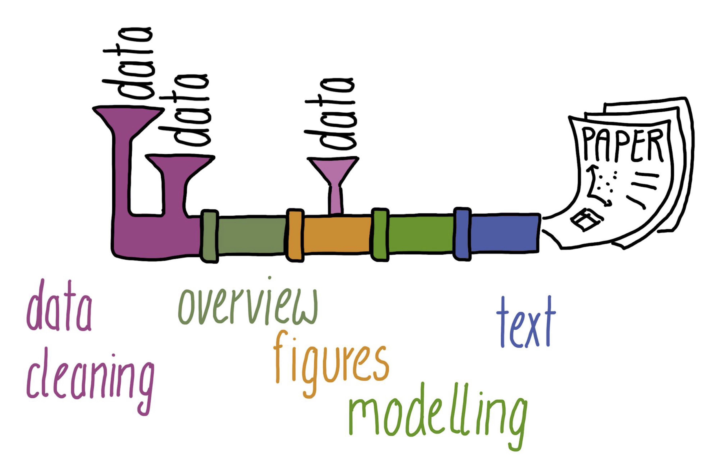{#fig-IdealisedPipeline}

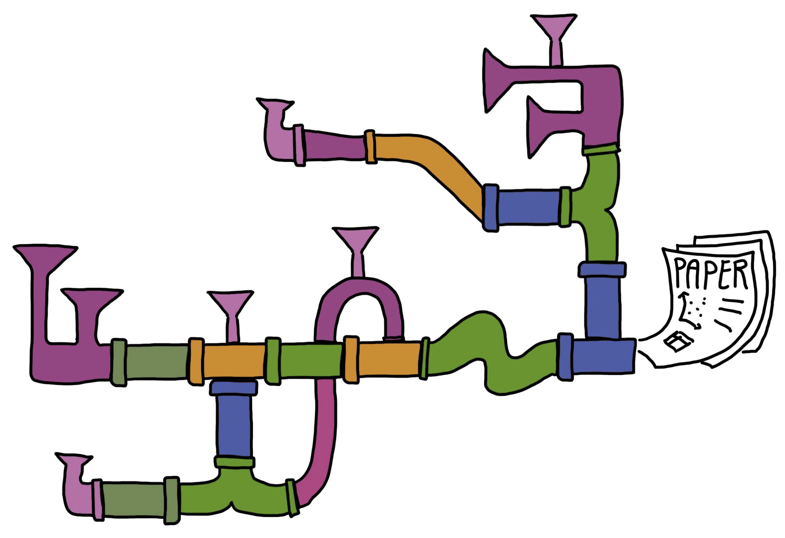{#fig-RealisticPipeline2}

Research workflows as pipelines [[CC BY 4.0](https://creativecommons.org/licenses/by/4.0/) @seiboldBERDCourseMake2023]
:::
```

::: {#fig-Pipelines layout-ncol="2"}
{#fig-IdealisedPipeline}

{#fig-RealisticPipeline2}

Research workflows as pipelines [[CC BY 4.0](https://creativecommons.org/licenses/by/4.0/) @seiboldBERDCourseMake2023]
:::

::: callout-note
#### Going further

To find out more about inserting and arranging figures, check out the detailed [Quarto guide](https://quarto.org/docs/authoring/figures.html).
:::

### Plots {#sec-QuartoPlots}

If your Quarto document includes code chunks that generate plots, they will automatically be integrated in your rendered document. Plots will either appear immediately after the corresponding code chunk or where the code chunk would be, if you chose to hide the code chunk that generated the plot with the `echo: false` option.

As with computed tables (see @sec-QuartoTables), various code chunk options can be added to customise the look of computed figures in rendered documents. Compare the code chunk options below and the generated output in @fig-scatterplot.

\pagebreak

```{r}
#| label: fig-scatterplot
#| fig-cap: "L2 participants' lexical proficiency in English and their professional occupational group"
#| fig-height: 5
#| fig-asp: 0.618
#| message: false
#| echo: fenced

L2.data |> 
  ggplot(mapping = aes(x = VocabR, 
                       y = CollocR)) +
  geom_point(aes(colour = OccupGroup),
             size = 2) +
  geom_smooth(method = "lm") +
  scale_colour_viridis_d() +
  labs(x = "Vocabulary test scores",
       y = "Collocation test scores",
       colour = "Occupational\ngroups") +
  theme_bw()
```

According to the authors of 'R for Data Science', figure sizing and scaling in R is "an art and science and getting things right can require an iterative trial-and-error approach" [@wickhamDataScienceImport2023]. This is because there are five main options that control figure sizing: `fig-width`, `fig-height`, `fig-asp`, `out-width` and `out-height`. The first three control the size of the figure created by `R`, whereas the latter two control the size at which it is inserted in the rendered document.

If you are sharing your research analyses and results in HTML format, you can also embed **interactive plots** [see @lefollDataAnalysisLanguage2025: [Section 10.2.8](https://elenlefoll.github.io/RstatsTextbook/10_Dataviz.html#sec-InteractivePlots)] in your Quarto documents. In HTML format, it is therefore possible to hover over @fig-scatterplot-plotly to explore the data interactively.

::: {.content-visible when-format="html"}
```{r}
#| label: fig-scatterplot-plotly
#| fig-cap: "An interactive plot of L2 participants' lexical proficiency in English"
#| eval: !expr 'knitr::is_html_output()'
#| message: false
#| warning: false
#| code-fold: true
#| code-summary: "Show R code to generate the interactive plot below."
#| fig-alt: "An interactive scatterplot with x-axis labeled as vocabulary test scores and y-axis labeled as grammar test scores. Each point represents an individual, colored by occupational group. Users can hover over each point to view additional details: VocabR, CollocR, L1, Age, Years in formal education, Job, OccupGroup. Unfortunately, I do not think that this hovering function will work with a screen reader."

#install.packages("plotly")
library(plotly)

L2.scatter2 <- L2.data |> 
  ggplot(mapping = aes(x = VocabR, 
                       y = CollocR,
                       text = paste("L1:", NativeLg, "</br>Age:", Age, "</br>Years in formal education:", EduTotal, "</br>Job:", Occupation))) +      
  geom_point(aes(colour = OccupGroup),
             size = 2) +
  scale_colour_viridis_d() +
  labs(x = "Vocabulary test scores",
       y = "Grammar test scores",
       colour = "Occupational\ngroups") +
  theme_bw()

ggplotly(L2.scatter2)

```
:::

::: {.content-visible when-format="pdf"}
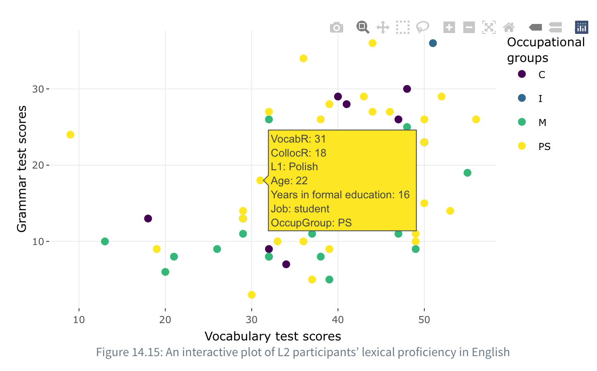{#fig-scatterplot-plotly fig-alt="A screenshot of an interactive scatterplot with x-axis labeled as vocabulary test scores and y-axis labeled as grammar test scores. Each point represents an individual, colored by occupational group. Users can hover over each point to view additional details: VocabR, CollocR, L1, Age, Years in formal education, Job, OccupGroup."}
:::

## Citations and references {#sec-References}

An important aspect of academic writing is the inclusion of in-text bibliographic references (**citations**) and a well-formatted list of references (also referred to as a **bibliography**). *RStudio*'s Visual editor makes inserting bibliographic references very convenient. To insert a reference, click on "Insert" and then select "Citation" or use the keyboard shortcut Cmd/Ctrl + Shift + F8. This opens up a menu (see @fig-QuartoCitation) giving you the option to search for the source that you'd like to cite on your own computer (e.g. in your own Zotero database, if you use Zotero), via the [Crossref](https://www.crossref.org/) database, or directly using a [DOI](https://forrt.org/glossary/english/doi/).

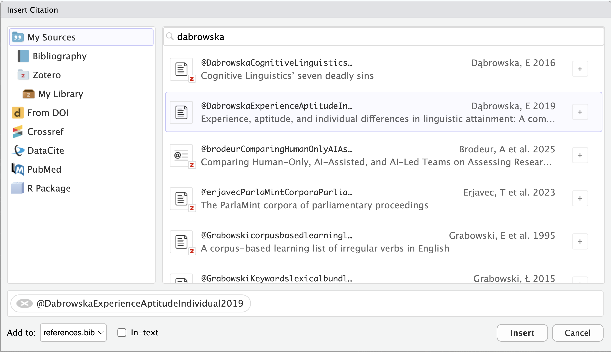{#fig-QuartoCitation}

Alternatively, if you start typing `@` in the Visual editor, a quick reference menu will appear. Either way, any references that you add will be displayed as `@` followed by a **reference identifier**. For example, in the source code of this Quarto document, every reference to @DabrowskaExperienceAptitudeIndividual2019 is indicated as `@DabrowskaExperienceAptitudeIndividual2019`.

::: callout-note
For more information on how to format your in-text citations, see the [Quarto guide](https://quarto.org/docs/authoring/footnotes-and-citations.html#sec-citations).
:::

::: {.content-visible when-format="pdf"}
 
:::

When you insert your first reference in a Quarto document, *RStudio* will automatically create a `references.bib` file in your project folder. All references are automatically added to this new [BibLaTeX](https://en.wikipedia.org/wiki/BibLaTeX) file. As shown in the example `references.bib` file below, `.bib` files contain entries that begin with `@` followed by the type of reference (`article`, `book`, `manual`, `url`, etc.) and the reference identifier (e.g. `DabrowskaExperienceAptitudeIndividual2019`, `wickhamDataScienceImport2023`). The rest of the entries contains structured information about each reference including its title, date of publication, and DOI or ISBN.

``` {.bib .unnumbered .unlisted filename="references.bib"}
@article{
  DabrowskaExperienceAptitudeIndividual2019,
  title={Experience, Aptitude, and Individual Differences in Linguistic Attainment: A Comparison of Native and Nonnative Speakers},
  volume={69},
  ISSN={1467-9922},
  url={https://onlinelibrary.wiley.com/doi/abs/10.1111/lang.12323},
  DOI={10.1111/lang.12323},
  number={S1},
  journal={Language Learning},
  author={Dąbrowska, Ewa},
  year={2019},
  pages={72–100}
}

@book{
  wickhamDataScienceImport2023,
  place={Beijing, Boston, Farnham, Sebastopol, Tokyo},
  edition={2},
  title={R for Data Science: Import, tidy, transform, visualize, and model data},
  ISBN={978-1-4920-9740-2},
  url={https://r4ds.hadley.nz/},
  publisher={O’Reilly},
  author={Wickham, Hadley and Çetinkaya-Rundel, Mine and Grolemund, Garrett},
  year={2023} 
}
```

\pagebreak

In order to connect this `bibliography.bib` file with our Quarto document, we need to add a `bibliography` key to our YAML header (see @sec-StartQuarto). Provided that our `references.bib` file is located in the same folder as our Quarto document (which is what *RStudio* does by default), we can simply add the following line to our document header:

```{yaml}
--- 
title: Learning Quarto
subtitle: "by reproducing the descriptive statistics of Dąbrowska's (2019) study"
author: Elen Le Foll
date: last-modified
bibliography: references.bib
---
```

With this modified YAML header, when the document is rendered, a bibliography will automatically be added to the end of the document. This means that, if you have citations in your document, it is a good idea to include a header section `# References` at the end of the document.

> ### References {.unnumbered .unlisted}
>
> Dąbrowska, Ewa. 2019. "Experience, Aptitude, and Individual Differences in Linguistic Attainment: A Comparison of Native and Nonnative Speakers." *Language Learning* 69 (S1): 72-100. <https://doi.org/10.1111/lang.12323>.
>
> Wickham, Hadley, Mine Çetinkaya-Rundel, and Garrett Grolemund. 2023. *R for Data Science: Import, Tidy, Transform, Visualize, and Model Data*. 2nd ed. O'Reilly. <https://r4ds.hadley.nz/>.

::: {.content-visible when-format="pdf"}
 
:::

By default, Quarto will use the [Chicago Manual of Style](https://chicagomanualofstyle.org/) author-date citation format (as above). However, we can point to a different **citation stylesheet** in the form of a `.csl` (Citation Style Language) file in the YAML header. This allows us to determine exactly how our bibliography and in-text citations should be formatted. Many institutions, publishers, and journals have their own (sometimes annoyingly specific!) requirements. Luckily, the open-source research community has put together a large repository of citation stylesheets for you to choose from: <https://www.zotero.org/styles>. You can download any of these stylesheets (as a `.csl` file), place the file in your project folder, and then link it to your Quarto document by adding a `cls` key to your header.

```{yaml}
---
title: Learning Quarto
subtitle: "by reproducing the descriptive statistics of Dąbrowska's (2019) study"
author: Elen Le Foll
date: last-modified
bibliography: references.bib
csl: international-journal-of-learner-corpus-research.csl
---
```

For example, if you wanted to submit your paper to the International Journal of Learner Corpus Research, you can download the [corresponding CLS stylesheet](https://www.zotero.org/styles/international-journal-of-learner-corpus-research) from the [Zotero styles database](https://www.zotero.org/styles), save it in your project folder, and link to it in your YAML header as above. When rendered, your document's bibliography will then read:

> ### References {.unnumbered .unlisted}
>
> Dąbrowska, E. (2019). Experience, Aptitude, and Individual Differences in Linguistic Attainment: A Comparison of Native and Nonnative Speakers. *Language Learning*, *69*(S1), 72-100. <https://doi.org/10.1111/lang.12323>.
>
> Wickham, H., Çetinkaya-Rundel, M., & Grolemund, G. (2023). *R for data science: Import, tidy, transform, visualize, and model data* (2nd ed.). O'Reilly. Retrieved from <https://r4ds.hadley.nz/>.

:::: {.content-visible when-format="html"}
::: {.callout-tip collapse="false"}
#### Your turn! {.unnumbered}

Using any of the methods described above, add an in-text bibliographic reference to the following article in your Quarto document:

> In'nami, Yo, Atsushi Mizumoto, Luke Plonsky & Rie Koizumi. 2022. Promoting computationally reproducible research in applied linguistics: Recommended practices and considerations. Research Methods in Applied Linguistics 1(3). 100030. <https://doi.org/10.1016/j.rmal.2022.100030>.

Specifically, we want to cite this passage from page 8:

> As implementing these steps may seem daunting, we recommend that researchers engage in reproducible research incrementally. That may be one small step for a researcher, but it will represent a giant leap for the field of applied linguistics when consolidated and accumulated in the long run.

[**Q11**]{style="color:green;"} If the key to this article in the `.bib` file is `innami2022`, which in-text citation can be used to cite this specific page within a Quarto document?

```{r}
#| echo: false
#| label: "Q11"

check_question("[@innami2022, p. 8]",
               options = c("[@innami2022, p. 8]",
                           "[@innami2022], p. 8]",
                           "([@innami2022], p. 8)"),
button_label = "Check answer",
q_id = "Q11", 
random_answer_order = TRUE,
type = "radio",
right = "That's right!",
wrong = "No, not quite.")
check_hint("You'll find detailed information on the formatting of in-text citations here: <https://quarto.org/docs/authoring/citations.html>.", hint_title = "🐭 Click on the mouse for a hint.")

```

Go to the [Zotero style repository](https://www.zotero.org/styles) and download the `.csl` citation stylesheet to format references according to the American Psychological Association (APA) 7^th^ edition. Link this stylesheet to your Quarto document and render to HTML.

[**Q12**]{style="color:green;"} Now that your document includes references formatted in APA7, how are the authors' names listed in your bibliography?

```{r}
#| echo: false
#| label: "Q12"

check_question("In’nami, Y., Mizumoto, A., Plonsky, L., & Koizumi, R.",
               options = c("In’nami, Y., Mizumoto, A., Plonsky, L., & Koizumi, R.", 
                           "In’nami, Yo, Atsushi Mizumoto, Luke Plonsky & Rie Koizumi", 
                           "In’nami et al.", 
                           "In’nami, Y., Mizumoto, A., Plonsky, L., and Koizumi, R.",
                           "In’nami, Yo, Atsushi Mizumoto, Luke Plonsky and Rie Koizumi"),
button_label = "Check answer",
q_id = "Q12", 
random_answer_order = TRUE,
type = "radio",
right = "Yes, well done! 👍",
wrong = "No, not quite. Citation styles can look very similar, but the devil is in the detail! 😈")
```
:::
::::

::: {.content-visible when-format="pdf"}
 
:::

::::::: callout-note
#### Literature management {.unnumbered}

Managing the large number of references that we need to consult, read, and cite when doing research can be a real challenge. The good news is that **reference management software** are there to help you overcome this challenge! Whether you are working on a term paper, a Master's dissertation, PhD thesis, or post-doctoral project, it is *always* worth investing the time to learn to use a reference manager!

::: {.content-visible when-format="pdf"}
 
:::

[Zotero](https://www.zotero.org/) is a free and open-source bibliographic reference manager that will help you organise all your sources and generate beautifully formatted bibliographies for all your projects. It offers various [browser extensions](https://www.zotero.org/download/) that enable you to quickly add references to your library directly from your web browser.

:::: {.content-visible when-format="html"}
::: column-margin
{width="100" fig-alt="A red Z on a folder with bookmarks."}
:::
::::

::: {.content-visible when-format="pdf"}
 
:::

What's more, Zotero can be integrated in RStudio, making it very easy to include BibTeX-formatted references in your Quarto documents. Find out more in the [*RStudio* documentation](https://rstudio.github.io/visual-markdown-editing/citations.html).

::: {.content-visible when-format="pdf"}
 
:::

Combining Zotero and Quarto also allows you to generate annotated bibliographies. Benjamin Tjepkes explains how to do this in a detailed [blog post](https://btjepkes.github.io/posts/building-annotated-bibliographies-with-quarto/).

::::::: 

# Reproducible research {#sec-Reproducibility}

Not only is using Quarto (or any other literate programming format, see @sec-LitProgramming) highly convenient, it also helps us make our research more reproducible. Unfortunately, the terms **reproducible**, **replicable** and **repeatable** are often confused and, not helping matters, some definitions in the literature contradict each other.

This guide adopts the terminology of [The Turing Way](https://book.the-turing-way.org/). We thus define **reproducibility** as the ability of an independent researcher or team to obtain the same results as in a study using the same data and methods as the original study (see @fig-reproducibility-terminology).

:::: {.content-visible when-format="html"}
::: column-margin
{width="100" alt-text="The Turing Way hexagonal logo features a large arrow forward representing the research process."}
:::
::::

This is in contrast to **replicability**, where the same methods, but different data are used; and **robustness**, where the same data, but different methods are used. Finally, if a finding can be reliably observed across different datasets with different methods, then we can say that the finding is **generalisable**.

 [The Turing Way Community](https://book.the-turing-way.org/reproducible-research/overview/overview-definitions) )](images/TuringWay_reproducible-matrix.jpg){#fig-reproducibility-terminology width="60%"}

Given this definition, reproducibility might seem like a low bar to pass. You might be thinking: shouldn't it be obvious that we'll get the same results if we repeat a study using exactly the same data and method? Well, yes, it should be. But it very often isn't! For a start, to be able to even attempt to reproduce the results of a study, the underlying data must be available, which is not always the case even when the publication includes the phrase "data available upon (reasonable) request" [@husseyDataNotAvailable2025]. Second, the data must be available in an accessible format and must be published together with enough documentation to be understandable to an independent researcher. Third, the author(s) of the original study need to have very diligently documented all their data wrangling and analyses steps. The best way to do this is undoubtedly to use code that does not require closed-source software (e.g. a researcher without a license for SPSS or Stata will not be able to run SPSS or Stata scripts). This open code must be shared in an accessible format, too. Fourth, independent researchers need to be able to run these scripts. To this end, it is important that they know exactly which tools were used. For example, if the analyses were conducted in R or Python, they need to know which R/Python version and which libraries and library versions were used (@sec-Packages). They also need to know in which order the scripts were run and, finally, the scripts must run on their own computers without any errors. So now, reproducibility doesn't sound quite so easy, right? Luckily, if we apply the principles of literate programming in Quarto, we can go a long way towards ensuring that our research is reproducible.

::: {.content-visible when-format="pdf"}
 
:::

::: callout-note
### Going further {.unnumbered collapse="TRUE"}

To find out more about best practices for reproducible research, check out [The Turing Way](https://book.the-turing-way.org/)'s excellent [Guide for Reproducible Research](https://book.the-turing-way.org/reproducible-research/reproducible-research).
:::

## Package versions and references {#sec-Packages}

In addition to referencing academic papers, it is also very important that we reference which **`R` version** we used for our analyses and which **packages** and package versions. This serves two purposes:

1.  Independent researchers (and our future selves!) know exactly what they need to be able to **reproduce** our analyses (see @sec-Reproducibility).
2.  We give **credit** to the kind people who spent time and effort developing and sharing the R packages that we used for our analyses [@lazerteHowCitePackages2021].

The easiest way to "give credit where credit is due" to `R` package developers is to use the [{grateful}](https://pakillo.github.io/grateful/) package. Its `cite_packages()` function will scan your project for all the `R` packages that are used and generate a BibTeX file called `grateful-refs.bib` that contains the package references. Having first installed the package, load the {grateful} library:

```{r}
#install.packages("grateful")
library(grateful)
```

:::: {.content-visible when-format="html"}
::: column-margin
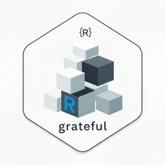{width="100" alt-text="The hexagonal logo of the grateful package features a pile of boxes that represent packages."}
:::
::::

Make sure that all the packages that your script relies on are loaded and then run the following command once to generate a bibliography of all loaded packages:

```{r}
#| eval: false
cite_packages(out.dir = getwd(),
              omit = NULL)
```

The `.bib` text generated by the {grateful} library should now be in your Quarto project directory. Next, add a reference to this BibTeX file in your YAML header. This means that your Quarto document will now have be linked to two bibliography files, which is fine as long as you use the following YAML syntax to reference them both (watch the indentation!):

```{yaml}
---
bibliography: 
  - references.bib
  - grateful-refs.bib
---
```

We can now call the `cite_packages(output = "paragraph")` function to generate a paragraph that mentions all the packages used in the document and add their references to the bibliography (either at the bottom of your rendered Quarto document or, in the case of this textbook, in the corresponding chapter, see @sec-References).

```{r}
#| include: false
options(renv.config.dependencies.limit = 10000)
```

```{r}
#| message: false
#| warning: false
#| eval: true

cite_packages(output = "paragraph", 
              out.dir = getwd(), 
              pkgs = "Session",
              omit = NULL)
```

Alternatively, `cite_packages()` can generate a table with all the package names, versions, and references. @tbl-packages lists the packages used in this chapter. To display functioning links and references, the table is rendered using the `kable()` function from the {knitr} package.

```{r}
#| eval: false
#install.packages("knitr")
pkgs <- cite_packages(output = "table", 
                      out.dir = getwd(), 
                      omit = NULL)
knitr::kable(pkgs)
```

```{r}
#| label: tbl-packages
#| echo: false
#| warning: false
#| message: false

pkgs <- cite_packages(output = "table", 
                      out.dir = getwd(),
                      pkgs = "Session",
                      omit = NULL)
knitr::kable(pkgs)
```

## Computing environment {#sec-Environment}

Tracking the versions of the packages that your code relies on is important if you want your analysis code to be **reproducible** in the long-run (i.e. so that you or a colleague can run it next month or next year). However, manually installing these packages with these exact versions is hardly feasible. To simplify the process of re-creating the same **project environment**, consider using {renv} or {rix}.

:::: {.content-visible when-format="html"}
::: column-margin
{width="100" fig-alt="The hex logo of the renv package features a plant growing in soil."}
:::
::::

The [{renv}](https://rstudio.github.io/renv/index.html) library [@usheyRenvProjectEnvironments2023] keeps track of the package versions that your project depends on, and ensures that those exact versions are installed whenever and wherever your project is opened. {renv} provides each project with its own isolated package library, ensuring that you can update packages in new projects without risking breaking older projects.

To create project-specific environments that additionally include system dependencies, you will need to check out the [{rix}](https://docs.ropensci.org/rix/) package [@rodriguesRixReproducibleData2026]. Both of these packages aim to make R projects more isolated, portable and therefore reproducible.

:::: {.content-visible when-format="html"}
::: column-margin
{width="100" fig-alt="The hex logo of the rix package features a horned animal that looks like a prehistoric drawing."}
:::
::::

::: callout-note
#### Going further

Accessible introductions to stabilising your computing environment can be found in the [BERD course "Make Your Research Reproducible"](https://berd-nfdi.github.io/BERD-reproducible-research-course/3-3-stabilize.html) [@seiboldBERDCourseMake2023] and [The Turing Way's guide to reproducible environments](https://the-turing-way.netlify.app/reproducible-research/renv.html) [@theturingwaycommunityTuringWayHandbook2022].
:::

## Version control

Another powerful tool very much worth learning to improve your research workflows is version control with [Git](https://git-scm.com/learn). Git can track changes to all our project documents over time, allowing us revert to previous versions whenever needed. For example, if we make a mistake or want to compare different versions of a Quarto document, Git can show us exactly what changes were made and when.

:::: {.content-visible when-format="html"}
::: column-margin
{width="100" fig-alt="The git logo is orange and shows part of tree diagram with a fork."}
:::
::::

Git is essential when it comes to collaboration. It allows multiple project contributors to simultaneously work on the same document(s) without overwriting each other's edits. For instance, if you and a colleague are both editing a Quarto document, Git can help you merge your changes seamlessly. Conveniently, *RStudio* has [built-in Git integration](https://docs.posit.co/ide/user/ide/guide/tools/version-control.html), facilitating the use of version control directly within our workflow. While a full hands-on introduction to Git is beyond the scope of this tutorial, learning Git has the potential to greatly improve your ability to manage and share your research effectively. There are many great resources to help you get started, e.g. the [Software Carpertry' guide to Git for novices](https://swcarpentry.github.io/git-novice/), [Reproducibility with Git and Quarto](https://genomicsaotearoa.github.io/reproducibility_with_git_and_quarto/git_overview.html), and [Happy Git and GitHub for the useR](https://happygitwithr.com/).

::: callout-note
#### Don't git muddled up!

[Git](https://git-scm.com/learn) and [GitHub](https://github.com/) are often confused. Git is an open-source version control system. GitHub, by contrast, is a popular, proprietary web-based hosting service for Git repositories owned by Microsoft. In addition to easing collaboration, storing version-controlled projects in a (public or private) online repository is an excellent additional backup strategy for many research projects. Alternatives to GitHub include [Codeberg](https://codeberg.org/) and [GitLab](https://about.gitlab.com/).
:::

# Sharing and publishing {#sec-PublishingFormats}

The default rendering format for Quarto documents is HTML. HTML has many advantages and is ideally suited to online publications, but the beauty of Quarto is that you can share and publish your research in many other formats, too.

) Allison Horst from the ["Hello, Quarto" keynote](https://mine.quarto.pub/hello-quarto/) by Julia Lowndes and Mine Çetinkaya-Rundel, presented at RStudio Conference 2022.](images/AHorst_many-qmd-to-output.png){#fig-Penguin fig-alt="A schematic showing many qmd files, going through Quarto, to generate an HTML, PDF, or Word document or more. The Quarto logo is depicted as a baseball a penguin is spinning." width="467"}

## Sharing HTML documents {#sec-EmbedResources}

You may have noticed that, in addition to creating an `.html` file, rendering your Quarto document has also generated a folder containing any necessary data, images, stylesheets or other files required to display the HTML version of your document. This is because, by default, Quarto keeps external resources separate from the main HTML file. While this is advantageous for large documents and complex projects, it does mean that your HTML document can only be viewed if both the `.html` file and its associated folder are shared.

If you want to share a single, self-contained `.html` file with someone else, you will need to **embed** all the necessary files directly inside your HTML file. This is achieved by adding the following option at the end of your document's YAML header:

```{yaml}
---
format:
  html:
    embed-resources: true
---
```

With this setting, Quarto will package all the necessary resources inside the HTML file, resulting in a self-contained document that is easy to share as it can be viewed in any web browser (e.g. Firefox, Google Chrome, Safari).

If you intend to share a longer Quarto document, it may be a good idea to number the headings and sub-headings (`number-sections`) and to include a table of content (`toc`). You can do this by adding the following two lines to the `format` section of your YAML header:

```{yaml}
---
format:
  html:
    embed-resources: true
    number-sections: true
    toc: true
---
```

There are many [ready-made HTML themes](https://quarto.org/docs/output-formats/html-themes.html) to choose from. The [HTML version](https://elenlefoll.quarto.pub/quarto4research) of this tutorial uses the `journal` theme in light mode, and `vapor` in dark mode.

## Word, LibreOffice & co.

Your supervisor or colleague may request a **Microsoft Word** version of your Quarto document and, thankfully, this is no problem. You can change the rendering format to a `.docx` file by amending the format option in your YAML header:

```{yaml}
---
format: docx
---
```

With this format option, rendering your Quarto document will generate a `.docx` file that includes your text, any code that you wanted to show in your document, and all of the code outputs that you wanted to share, such as your statistics, graphs, and tables. Some of the formatting options available for HTML also work in the `.docx` format:

```{yaml}
---
format:
  docx:
    embed-resources: true
    number-sections: true
    toc: true
---
```

Note, however, that any options that are not available in the rendering format specified are ignored without warning or error messages.

 

::: callout-warning
#### Not rendering code chunks in specific formats

Dynamic code outputs, such as the **interactive** {plotly} graph displayed in @fig-scatterplot-plotly, cannot be meaningfully rendered to **static formats**, such as Microsoft Word or PDF. Attempting to do so can cause rendering errors such as:

```         
Error: Functions that produce HTML output found in document 
targeting docx output.
Please change the output type of this document to HTML.
```

To fix this, add the following options to any code chunk that generates content that only works in HTML:

```{r}
#| eval: !expr 'knitr::is_html_output()'
#| echo: fenced
ggplotly(L2.scatter2)
```

These options ensure that the code chunk is ignored when the document is rendered to any format other than HTML.
:::

 

When you open the `.docx` version of your Quarto document in Microsoft Word, you may get a number of warnings (e.g. @fig-MSWordWarnings). You can safely click "Yes" or "Close" to get rid of these warnings and open up your Word file. If, for some reason, you cannot open a rendered document in Microsoft Word, try rendering to `.odt` instead (see below).

::: {#fig-MSWordWarnings layout-ncol="2"}
{#fig-WordRecovery fig-alt="Dialog menu from Microsoft Word that reads: Word found unreadable content in LearningQuarto3.docx. Do you want to recover the contents of this document? If you trust the source of this document, click Yes. Below the message there are two buttons: Yes and No." width="237"}

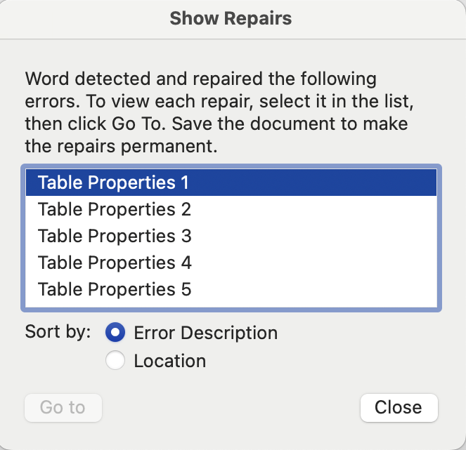{#fig-WordRepairs fig-alt="Dialog menu from Microsoft Word entitled: Repairs. It reads: Word detected and repaired the following errors. To view each repair, select it in the list, then click Go To. Save the document to make the repairs permanent. Table Properties 1 Table Properties 2 Table Properties 3 etc. There is one button: Close" width="237"}

Examples of popup menus that may appear when opening the `.docx` version of a Quarto document.
:::

To control more stylistic elements (e.g. font types, sizes, page margins, etc.) when rendering to Word, it is also possible to reference a Word template in the YAML (for details, consult the official [Quarto Guide](https://quarto.org/docs/output-formats/ms-word-templates.html)).

To share your work with **LibreOffice**, **OnlyOffice**, and **OpenOffice** users, use the `.odt` rendering option. This will generate an OpenDocument -- an open standard file format that can be opened in any text-processing software, including Microsoft Word.

```{yaml}
---
format: odt
---
```

By default, the quality of the images and graphs in rendered `.docx` and `.odt` files is low. This is to keep the file size reasonable. High-quality images can be rendered by specifying the **image definition** in the YAML option. To do so, replace the format line that you added above with the following lines. Make sure that you indent each line correctly as shown below; otherwise, you will get an error when you try to render your document.

```{yaml}
---
format: 
  odt:
    fig-dpi: 300
---
```

:::: {.content-visible when-format="html"}
::: {.callout-tip collapse="false"}
#### Your turn! {.unnumbered}

[**Q13**]{style="color:green;"} Use in-text code chunks to fill the gaps in the following paragraph describing the `GrammarR` variable in `L1.data` and `L2.data` [@DabrowskaExperienceAptitudeIndividual2019]. Render your paragraph to `.docx` or `.odt` format to check the results.

> On average, English native speakers performed only marginally better in the English grammatical comprehension test (median = \_\_\_\_\_\_) than English L2 learners (median = \_\_\_\_\_\_). However, L1 participants' grammatical comprehension test results ranged from \_\_\_\_\_\_to \_\_\_\_\_\_, whereas L2 participants' results ranged from \_\_\_\_\_\_to \_\_\_\_\_\_.
:::
::::

::::: {.content-visible when-format="html"}
:::: {.callout-note collapse="true"}
#### Click here for the solution to [**Q13**]{style="color:green;"}

Below is a screenshot of a Quarto document with the inline code chunks and its rendered `.odt` version as opened in LibreOffice Writer. You can click on the images to zoom in.

::: {layout-ncol="2"}
{#fig-SourceCode fig-alt="The paragraph with inline code in Quarto reads: On average, English native speakers performed only marginally better in the English grammatical comprehension test (median = `r median(L1.data$GrammarR)`) than English L2 learners (median = `r median(L2.data$GrammarR)`). L1 participants' grammatical comprehension test results ranged from `r min(L1.data$GrammarR)` to `r max(L1.data$GrammarR)`. In this same test, L2 participants' results ranged `r min(L2.data$GrammarR)` to `r max(L2.data$GrammarR)`."}

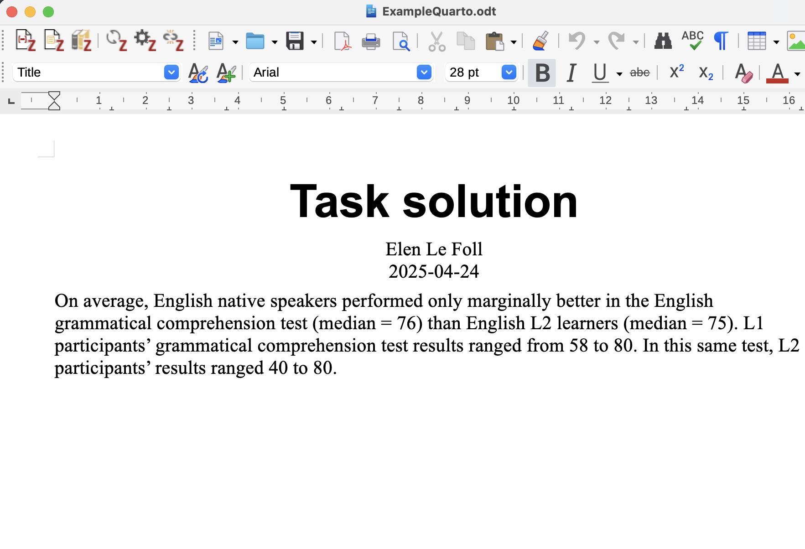{#fig-LibreOfficeScreenshot}
:::
::::
:::::

## PDF

It is also possible to render Quarto documents to PDF; however, this requires you to have [LaTeX](https://en.wikipedia.org/wiki/LaTeX) installed on your computer. Alternatively, you can use [Typst](https://quarto.org/docs/output-formats/typst.html) --- a new open-source markup-based typesetting system designed to be as powerful as LaTeX but easier to use.

If you don't already have your favourite LaTex distribution, Quarto developers recommend that you use the [TinyTeX](https://yihui.org/tinytex/) distribution to render `.qmd` files to PDF. To **install** (or update) TinyTeX, go to the Terminal pane in *RStudio* and run the following command:

``` {.txt filename="Terminal"}
quarto install tinytex
```

This is likely to take a few minutes but you will only need to do it once. Afterwards, you can add the following line to your Quarto YAML header and you're ready to render to PDF! If you run into any issues installing {tinytex}, consult the [tinytex FAQ page](https://yihui.org/tinytex/faq/).

```{yaml}
---
format: pdf
---
```

HTML being the default format, some options available for HTML are not -- at least by default -- available in other publishing formats. Many of the basic options, however, work across different formats. The YAML header options below can be used to include a table of content with numbered sections at the start of the PDF version of your document. It also includes two options that are specific to the PDF format and which are particularly useful for academic writing: the first will print a list of figures (`lof`) and the second a list of tables (`lot`).

```{yaml}
---
format:  
  pdf:
    number-sections: true
    toc: true
    lof: true
    lot: true
---    
```

## Slides

In research, it's quite common that you will be working on a project that will be submitted as a paper or thesis (e.g. in PDF format) *and* that you'll also want to **present** in class, to your research group, or at a conference. Conveniently, we can turn any Quarto document into **presentation slides**. At the time of writing, there are three presentation formats to choose from.

+----------------------------------------------------------------------+---------------------------------------------------------------------+--------------------+
| [Revealjs](https://quarto.org/docs/presentations/revealjs/)          | An open-source HTML presentation framework.                         | `format: revealjs` |
+----------------------------------------------------------------------+---------------------------------------------------------------------+--------------------+
| [Power-Point](https://quarto.org/docs/presentations/powerpoint.html) | Microsoft Office's presentation editing software.                   | `format: pptx`     |
+----------------------------------------------------------------------+---------------------------------------------------------------------+--------------------+
| [Beamer](https://quarto.org/docs/presentations/beamer.html)          | A LaTeX class for producing presentations and slides in PDF format. | `format: beamer`   |
+----------------------------------------------------------------------+---------------------------------------------------------------------+--------------------+

I recommend using **Revealjs**. The best way to get a sense of what is possible is to explore the [demo](https://quarto.org/docs/presentations/revealjs/demo/){target="_blank"} presentation from the [Quarto Guide](https://quarto.org/docs/presentations/revealjs/).

:::: {.content-visible when-format="html"}
<div>

```{=html}
<iframe width="600" height="400" class="slide-deck" src="https://quarto.org/docs/presentations/revealjs/demo/"></iframe>
```

</div>

To view the demo in a standalone browser tab, head to the [Quarto Guide](https://quarto.org/docs/presentations/revealjs/demo/){target="_blank"}. You can also out the [source code](https://github.com/quarto-dev/quarto-web/blob/main/docs/presentations/revealjs/demo/index.qmd) to see how the slides were created.
::::

# Going further with Quarto

This chapter only just scratched the surface of what's possible in Quarto. The official [Quarto Guide](https://quarto.org/docs/guide/) is very detailed, but highly accessible and well worth exploring to find out what else you can do in Quarto. Check out the [Quarto Gallery](https://quarto.org/docs/gallery/) to get a sense of what's possible. From books to interactive dashboards, the world's your oyster!

 [Allison Horst](https://allisonhorst.com/cetinkaya-rundel-lowndes-quarto-keynote) from the ["Hello, Quarto" keynote](https://mine.quarto.pub/hello-quarto/#/hello-quarto-title) by Julia Lowndes and Mine Çetinkaya-Rundel, first presented at the RStudio Conference 2022](images/AHorst_Penguins.png){fig-alt="One penguin standing on another penguin's shoulders in a snowscape, looking through a telescope at a Quarto logo moon in the night sky." width="80%"}

::: callout-note
#### Further resources

-   [Quarto for Scientists](https://qmd4sci.njtierney.com/) by Nicholas Tierney is well worth checking out. There are many overlaps with this tutorial but, as a "living book", it is being regularly updated and expanded. The chapter on [Common Problems with Quarto (and some solutions)](https://qmd4sci.njtierney.com/common-problems.html) is particularly useful.

-   The latest edition of "[R for Data Science](https://r4ds.hadley.nz/communicate)" also has a great chapter on communicating the results of data science projects using Quarto.

-   Quarto has many functionalities that are particularly attractive to those of us involved in higher education teaching and academic research. Watch [Quarto for Academics](https://www.youtube.com/embed/EbAAmrB0luA?si=AwJ3szmUKECHfwuS) (20 minutes) by Mine Çetinkaya-Rundel to find out more. In addition, the University of Utrecht has published a [great resource](https://utrechtuniversity.github.io/open-textbooks/) on creating open textbooks with Quarto and GitHub Pages.

-   Thinking of writing a term paper, thesis, dissertation, or book in Quarto? Cameron Patrick wrote his doctoral thesis in Quarto and has helpfully put together some [great tips](https://cameronpatrick.com/post/2023/07/quarto-thesis-formatting/) so that his "pain and suffering can help reduce yours". Similarly, Gina Reinhard wrote her M.A. thesis as a single Quarto document and has made her [Quarto template for term papers and theses](https://github.com/ginareinhard/thesisTemplate) available to all in open access.

-   Last but not least, [Awesome Quarto](https://github.com/mcanouil/awesome-quarto) provides a curated and regularly updated list of the many Quarto-related docs, talks, tools, examples, and articles that the internet has to offer.
:::

::: {.content-visible when-format="html"}
### Conclusion {.unnumbered .unlisted}

Well done! You have successfully completed this chapter on literate programming using Quarto. You have answered [`r checkdown::insert_score()` out of 12 questions]{style="color:green;"} correctly.

Are you confident that you can...?

-   [ ] Explain what literate programming is to a friend or colleague (@sec-LitProgramming)
-   [ ] Write and format text (bold, first-level heading, italics, etc.) in a Quarto document (@sec-Markdown)
-   [ ] Insert a code chunk in a Quarto document and use inline codes (@sec-Chunks)
-   [ ] Insert code chunks in a Quarto document and make use of inline code (@sec-Inline)
-   [ ] Insert tables in a Quarto document (@sec-QuartoTables)
-   [ ] Embed images and plots in a Quarto document (@sec-QuartoFigures)
-   [ ] Explain why making our research reproducible is not as that simple as it sounds (@sec-Reproducibility)
-   [ ] Render (i.e. export) your `.qmd` document to HTML, Microsoft Word or LibreOffice Writer, and PDF (@sec-PublishingFormats)
:::

## References {.unnumbered}
